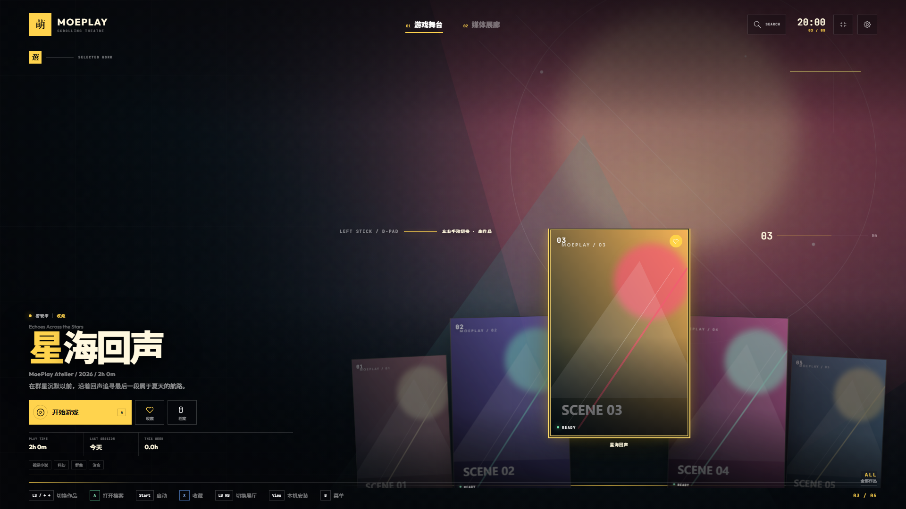
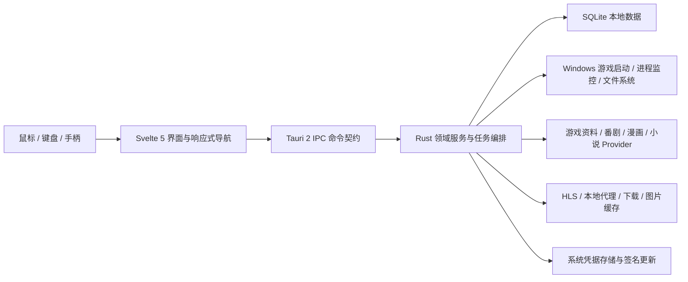

# 萌游 MoeGame

<div align="center">

**把散落在电脑里的游戏、番剧、漫画与阅读记录，整理成一座属于自己的数字娱乐馆。**

面向 **Windows 桌面、电视大屏与手柄操作** 的本地优先游戏 / ACG 媒体中心。

[](https://github.com/Cicada0719/moeplay-tauri/releases/latest)
[](https://github.com/Cicada0719/moeplay-tauri/releases/latest)
[](https://v2.tauri.app/)
[](https://svelte.dev/)
[](LICENSE)

[下载最新版](https://github.com/Cicada0719/moeplay-tauri/releases/latest) · [功能与更新](CHANGELOG.md) · [提交问题](https://github.com/Cicada0719/moeplay-tauri/issues) · [参与开发](#参与项目)

</div>



<p align="center"><sub>大屏滚动剧场：全屏作品背景、底部手动封面轮、手柄焦点与动态操作提示。</sub></p>

> [!IMPORTANT]
> 当前正式发布平台为 **Windows 10/11 x64**，提供安装版与便携版。项目目前不发布 Android 版本，Release 中没有 APK 或 AAB。

## 萌游是什么？

萌游不是又一个“给文件夹换皮”的启动器。

它希望把 **游戏库管理、作品资料、启动与游玩记录、番剧播放、漫画阅读、小说阅读、统计和存档工具** 放进同一套视觉与交互系统：坐在电脑前可以用鼠标键盘高效整理，接上电视和手柄后又能直接进入适合远距离观看的全屏作品舞台。

所有核心资料默认保存在本机。你的收藏、评分、笔记、进度和游玩记录，不需要为了使用软件而上传到一个陌生账号体系。

## 为什么值得试试

| 体验 | 萌游提供的能力 |
| --- | --- |
| **一个库，装下不同来源** | 导入 Steam、Epic、本地游戏和模拟器内容，并统一管理封面、背景、标签、合集和启动方式。 |
| **真正为电视设计的大屏模式** | 不是简单放大桌面 UI，而是独立的全屏滚动剧场：作品背景覆盖屏幕，信息集中在左下角，封面通过手柄手动切换。 |
| **从管理到消费不换应用** | 游戏启动、番剧选源播放、漫画阅读、小说阅读与历史记录都在同一个应用中完成。 |
| **本地优先** | SQLite 保存核心数据；联网主要用于资料检索、媒体来源、平台同步和更新检查。 |
| **可观察、可维护** | 来源健康度、任务中心、下载队列、诊断工具、缓存清理、备份与发布校验都不是“黑盒”。 |
| **开源且可自建** | Tauri 2 + Rust + Svelte 5，MIT License，欢迎检查、修改和贡献。 |

## 功能全景

### 🎮 游戏库与作品档案

- 自动发现并导入 **Steam** 与 **Epic Games** 已安装内容。
- 添加本地可执行文件，并管理工作目录、启动参数与自定义启动方式。
- 内置 20+ 模拟器定义，可扫描模拟器与 ROM，覆盖 RetroArch、PCSX2、Dolphin、RPCS3、PPSSPP、DuckStation、Ryujinx、Cemu、MAME 等常见方案。
- 使用 Bangumi、VNDB、DLSite、Steam、PCGamingWiki、Getchu、ErogameScape、TouchGal、YMgal、Kungal 等来源补全作品资料。
- 管理封面、背景、截图、标签、合集、评分、收藏、笔记和作品说明。
- 记录最近启动、累计时长、每周活动与继续游玩内容。
- 提供搜索、筛选、智能合集、批量处理、资料刮削和游戏目录入口。
- 支持 Locale Emulator 检测与日语环境启动，适合需要区域环境的旧游戏。

### 📺 大屏滚动剧场与完整手柄导航

- 独立于普通游戏库的 **电视端全屏作品舞台**，针对 1080p、4K、超宽屏和较低高度窗口做响应式适配。
- 作品背景扩散覆盖整块屏幕；标题、说明、启动、收藏和档案操作收纳在左下角，尽量不遮挡主视觉。
- 底部封面轮使用左摇杆或 D-Pad 手动逐项切换，**不会自动轮播抢走焦点**。
- 普通模式和大屏模式均支持手柄空间导航、焦点恢复、动态按键提示和弹层操作。
- 可在游戏库、记录、番剧、漫画、小说、搜索、媒体展厅和作品档案之间往返操作。
- “专注布局”可临时隐藏辅助区域，为当前任务释放更多空间；不同主页面分别记忆状态。
- 支持系统“减少动态效果”设置，兼顾舒适度和可访问性。

### 🎬 番剧搜索与播放

- 兼容 Kazumi 社区规则结构，支持规则导入、并行搜索、线路选择、换源和失败回退。
- 接入 Bangumi 日历与作品资料，聚合收藏、历史和播放进度。
- HLS.js、原生媒体播放、网页播放与外部播放器多级兜底。
- 本地代理处理 Referer、Origin、分片与跨域兼容问题，并记录来源健康状态。
- 支持反爬验证提示、播放源探测、超时保护和自动换源排序。
- 提供弹幕、倍速、画中画、全屏、截图识番和外部打开等常用操作。
- 可选本地 GPU 画质增强预设，在设备性能允许时提升输出清晰度。
- 可接入 Jellyfin 和本地媒体来源，统一进入番剧检索与播放流程。

### 📚 漫画与小说阅读

- 漫画来源采用统一 Provider 架构，可接入 **Komga、Kavita 和本地来源**，并保留独立的在线漫画入口。
- 支持漫画搜索、作品详情、章节列表、翻页、换话、缩放、收藏与阅读进度。
- 来源中心可统一调整启用状态、优先级并执行健康检查。
- 小说阅读支持 **Project Gutenberg / Gutendex** 与 **中文维基文库** 的检索、详情和正文阅读。
- 游戏、番剧、漫画和小说共享统一的键盘、手柄与响应式交互规则。

### 📈 记录、统计与实用工具

- 活动时间线、游玩档案、继续游玩、周期统计和 Chart.js 图表。
- 任务中心统一展示刮削、下载、来源验证等后台任务及事件记录。
- 下载任务支持暂停、恢复、重试、取消和完成项清理。
- 游戏存档管理、备份与恢复入口。
- 系统诊断可检查运行环境、关键路径和 Locale Emulator 等依赖。
- 缓存统计与安全清理、设置恢复、签名自动更新。
- 可选 AI 增强，用于资料翻译、整理和清理预览；密钥通过系统凭据存储，而不是写入普通配置文件。

## 快速开始

### 普通用户

1. 打开 [GitHub Releases](https://github.com/Cicada0719/moeplay-tauri/releases/latest)。
2. 根据需要下载：
   - **NSIS 安装版**：推荐大多数用户，支持应用内签名自动更新。
   - **MSI 安装版**：适合 Windows Installer 或集中部署场景。
   - **Portable 便携版**：解压即用，不写入系统安装记录。
3. 首次启动后，导入 Steam / Epic、本地游戏或模拟器内容。
4. 根据需要配置资料来源、番剧规则、漫画服务和外部播放器。
5. 接入手柄后可按 `Start` 进入大屏模式，也可以从主导航进入。

> [!NOTE]
> 萌游依赖 Microsoft WebView2 Runtime。Windows 10/11 通常已随系统或 Edge 安装；如果应用无法显示界面，请先安装或修复 WebView2 Runtime。

### 常用手柄操作

| 按键 | 默认行为 |
| --- | --- |
| 左摇杆 / D-Pad | 移动焦点、切换作品或调整控件 |
| A | 确认、打开、播放或启动 |
| B | 返回上一级或关闭弹层 |
| X | 聚焦当前页面搜索 |
| Y | 收藏等卡片次要操作 |
| LB / RB | 切换主内容分类或大屏展厅 |
| View | 切换专注布局 |
| Start | 进入或退出大屏模式 |

实际提示会根据当前页面、焦点和手柄状态动态变化。

## 数据、隐私与内容说明

- 游戏资料、收藏、评分、笔记、进度、活动记录和设置默认保存在本机 SQLite 数据库。
- 网络请求只在执行资料搜索、下载媒体、连接已配置服务、同步平台库或检查更新等操作时产生。
- API Key 等敏感凭据使用系统凭据存储；仓库忽略本地数据库、日志、密钥和构建产物。
- 下载、代理与日志路径会经过范围限制和敏感字段保护。
- 萌游 **不内置游戏、番剧、漫画或小说版权内容**。第三方来源的可用性、访问权限和内容权利归对应服务及权利人所有，请在当地法律与服务条款允许的范围内使用。

## 技术架构



### 主要技术栈

| 层级 | 技术 |
| --- | --- |
| 桌面容器 | Tauri 2 |
| 前端 | Svelte 5、TypeScript、Vite 6 |
| 后端 | Rust、Tokio、Reqwest |
| 本地数据 | SQLite（rusqlite bundled） |
| 媒体 | HLS.js、本地播放代理、外部播放器兜底 |
| 视觉与统计 | GSAP、Three.js、Chart.js |
| 安全 | CSP、系统 Keyring、签名自动更新、依赖与许可证审计 |
| 测试 | Vitest / Testing Library、Playwright、Rust tests、Clippy |
| 发布 | GitHub Actions、NSIS、MSI、Portable、SBOM、构建元数据 |

### 设计原则

1. **Local-first**：用户资料首先属于用户自己的电脑。
2. **输入方式平等**：鼠标、键盘和手柄都应能完成核心流程。
3. **来源可替换**：媒体和资料服务通过 Provider / Rule 层隔离，单一来源失效不应拖垮整个应用。
4. **失败可解释**：后台任务、来源健康、诊断与更新都提供可见状态，而不是静默失败。
5. **发布可验证**：版本、命令契约、安装包、更新清单和签名必须保持一致。

## 项目结构

```text
src/
├─ lib/components/              页面与通用界面组件
├─ lib/features/                游戏、番剧、漫画、小说、活动等功能模块
├─ lib/actions/a11y/            键盘、焦点与手柄空间导航
├─ lib/stores/                  前端状态与本地偏好
└─ lib/api/                     Tauri IPC 调用与类型契约

src-tauri/
├─ src/commands/                暴露给前端的 Tauri 命令
├─ src/services/                游戏库、活动与 AI 变更等应用服务
├─ src/providers/               番剧和漫画来源适配器
├─ src/repositories/            数据访问与状态持久化
├─ src/scraper/                 多来源游戏资料抓取与合并
└─ src/db_sqlite.rs             SQLite 数据模型与仓储实现

plugins/                        项目内 Tauri 插件
scripts/                        构建、审计、SBOM、更新与发布校验
tests/                          Playwright 流程、响应式与视觉回归
.github/workflows/              Windows CI、夜间任务与签名发布
```

## 本地开发

### 环境要求

- Node.js 20
- Rust stable（含 `rustfmt`、`clippy`）
- Windows 10/11 x64
- Microsoft WebView2 Runtime
- Visual Studio C++ Build Tools

### 启动项目

```powershell
# 安装前端依赖
npm ci

# 启动 Tauri 桌面开发环境
npm run tauri dev
```

### 检查与测试

```powershell
# Svelte / TypeScript 静态检查
npm run check

# 前端单元测试
npm run test:unit

# 前端正式构建
npm run build

# Playwright 界面测试
npm run test:visual

# Rust 格式、静态检查与测试
cargo fmt --manifest-path src-tauri/Cargo.toml -- --check
cargo clippy --manifest-path src-tauri/Cargo.toml --all-targets --all-features -- -D warnings
cargo test --manifest-path src-tauri/Cargo.toml --all-targets --all-features
```

### 构建 Windows 安装包

```powershell
npm run tauri build
```

便携包、SBOM、构建元数据和更新清单由 `scripts/` 下的发布工具与 GitHub Actions 生成并校验，不建议手工拼装正式 Release。

## 发布质量门槛

正式版本发布前会依次检查：

1. npm 与 Cargo 依赖安全、许可证和供应链策略。
2. npm / Cargo / Tauri 版本号一致性。
3. 前后端 Tauri 命令契约是否同步。
4. Rust format、Clippy 和完整测试。
5. Svelte / TypeScript 检查、前端单元测试与生产构建。
6. Playwright 核心流程、手柄导航、响应式和视觉回归。
7. 前端体积预算、Windows 安装包与 Portable 构建。
8. SBOM、构建元数据、Release Manifest、更新包和分离签名。
9. `latest.json` 与 GitHub Release 资产一致性。

自动更新资源未签名或校验失败时，Release 不会被公开为客户端可见的正式版本。

## 参与项目

欢迎通过以下方式帮助萌游：

- 在 [Issues](https://github.com/Cicada0719/moeplay-tauri/issues) 报告可复现的问题。
- 提交新来源适配、规则兼容、手柄导航或响应式布局改进。
- 补充不同分辨率、不同手柄和不同 Windows 环境下的测试反馈。
- 改进文档、翻译、无障碍体验和新用户引导。

提交问题时建议附上：萌游版本、Windows 版本、复现步骤、相关日志，以及不包含隐私信息的截图。

## 常见问题

<details>
<summary><strong>萌游会替代 Steam、Epic、Jellyfin、Komga 或 Kavita 吗？</strong></summary>

不会。萌游更像统一入口和本地资料层：它负责整理、展示、启动、记录和衔接你已经拥有或已经配置的内容与服务。
</details>

<details>
<summary><strong>为什么有些番剧或漫画来源突然不可用？</strong></summary>

第三方站点可能调整页面、接口、反爬策略或访问区域。可以在来源中心检查健康状态、更新规则、切换线路，或使用自己的 Jellyfin、Komga、Kavita 与本地媒体。
</details>

<details>
<summary><strong>是否必须使用 AI 功能？</strong></summary>

不需要。AI 增强是可选功能，关闭后不影响游戏库、媒体播放、阅读、记录和大屏模式。
</details>

<details>
<summary><strong>有没有手机版？</strong></summary>

当前正式发布只支持 Windows 10/11 x64，不提供 Android APK/AAB。
</details>

## 许可证与免责声明

项目源代码采用 [MIT License](LICENSE)。

Steam、Epic Games、Bangumi、VNDB、DLSite、Jellyfin、Komga、Kavita 等名称和商标归各自权利人所有；本项目与这些服务不存在官方隶属或背书关系。游戏封面、背景、番剧、漫画和小说内容的权利归原作者、发行方或对应服务所有。

---

<div align="center">

如果萌游刚好解决了你的游戏库或客厅娱乐整理问题，欢迎点一个 **Star**、分享使用反馈，或者把你希望看到的功能写进 Issue。

</div>
