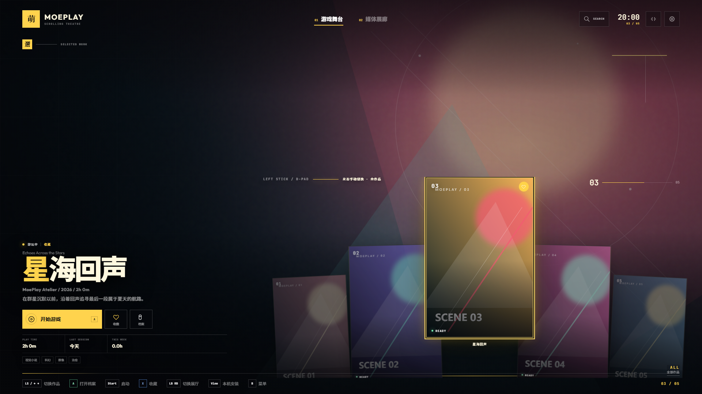

# 萌游 MoeGame

萌游是一个本地优先的游戏库与 ACG 媒体中心，使用 Tauri 2、Svelte 5、TypeScript 和 Rust 构建。它把本地游戏、模拟器 ROM、番剧、漫画、小说、收藏和阅读/观看记录放在同一个入口中。

桌面端侧重游戏资料管理和大屏浏览；Android 端使用 PSP/XMB 风格的掌机界面，优先适配实体手柄，同时保留触控操作。

<p align="center">
  <a href="http://192.168.2.88:8788/">局域网下载页</a> ·
  <a href="https://github.com/sgyxyx-prog/moeplay-tauri/releases/tag/v0.22.0">GitHub Release v0.22.0</a> ·
  <a href="https://github.com/sgyxyx-prog/moeplay-tauri/issues">反馈问题</a> ·
  <a href="https://github.com/sgyxyx-prog/moeplay-tauri/pulls">参与开发</a>
</p>



## 当前发布状态

| 项目 | 状态 |
| --- | --- |
| Windows 10/11 x64 | 已提供 MSI、NSIS 和 Portable 版本；v0.22.1 起支持局域网自动更新 |
| Android 掌机版 | 已提供 ARM64 Debug APK，可直接 adb 安装验证（见 v0.22.0 Release） |
| 更新服务器 | `http://192.168.2.88:8788/`（下载页 + `latest.json`，见「局域网自动更新」章节） |
| 默认分支 | `master` |
| 当前版本 | `0.22.1` |
| 许可证 | [MIT License](LICENSE) |

`v0.22.0` Release 提供 Windows 安装包与 Android ARM64 Debug APK。Android 端当前为本地构建的 Debug 包，适合实体机 adb 安装测试；正式分发时再使用签名 Release/AB 构建。

## 功能

### 掌机首页与手柄导航

- Android 启动后进入统一掌机首页，游戏、番剧、漫画和小说共享同一套入口。
- 顶部频道使用 `LT/RT` 切换“继续、游戏、番剧、漫画、小说”。
- 游戏频道使用 `LB/RB` 切换“全部游戏”和实际存在的模拟器平台。
- 十字键或左摇杆在当前平台的游戏转盘中移动，按 `A` 启动游戏。
- `Y` 打开详情，`X` 收藏，`View` 打开完整游戏库，`Start` 打开模拟器导入，`B` 返回或关闭弹层。
- 支持触控点击和左右滑动；焦点、弹层和操作提示会随页面状态变化。
- Android 默认隐藏状态栏和底部系统导航栏；设置中可以关闭沉浸式显示。
- 番剧、漫画和小说进入后自动使用横屏媒体布局，离开媒体页后恢复用户方向设置。

### 游戏库与模拟器

- 导入 Steam、Epic、本地目录和单个可执行文件。
- 扫描模拟器目录与 ROM，按平台整理游戏档案。
- 支持 RetroArch、PPSSPP、PCSX2、Dolphin、RPCS3、DuckStation、Ryujinx、Cemu、MAME 等常见模拟器定义。
- 管理封面、背景、图标、标签、合集、评分、备注、收藏和启动参数。
- 支持工作目录、Locale Emulator、存档备份、运行记录和继续游玩。
- 游戏库与掌机首页共用数据，掌机端导入的 ROM 也会出现在桌面游戏库中。

### 番剧

- 使用规则和 Provider 层接入多个来源，支持搜索、详情、剧集、选源和换源。
- 播放器支持原生视频、HLS、本地代理和网页/外部播放器降级路径。
- 保留续播、真实视频比例、弹幕、倍速、画中画、全屏、下载和播放错误恢复。
- 来源健康状态和规则导入/导出集中在来源中心，单个来源失败不会阻断其他功能。
- Android 播放页采用视频优先布局，控制栏和选集/来源操作适配横屏手柄使用。

### 漫画与小说

- 支持在线漫画来源、本地服务和 Komga/Kavita Provider。
- 漫画提供搜索、详情、章节、收藏、评论、章节图片和阅读历史。
- Android 默认横屏双页 RTL 阅读，也可以切换单页或 LTR；桌面端保持单页默认。
- 跨页图片独占显示，翻页失败会停留在当前页并提供重试；阅读位置按单页索引保存。
- 小说支持来源搜索、详情、章节和正文阅读。
- Android 默认分页阅读，同时支持连续滚动；桌面端默认连续滚动。
- 支持深色、纸张和棕褐主题，以及字号、行高和阅读模式设置。
- 分页和连续模式共用内容百分比，窗口尺寸变化后恢复到相同位置。

### 统一媒体历史

番剧、漫画和小说共用一条媒体历史时间线：

- 首页“继续”根据最近活动显示可续播/续读内容。
- 历史页支持全部、番剧、漫画、小说筛选。
- 番剧记录集数和播放位置；漫画记录章节和页码；小说记录章节和内容百分比。
- 从首页或历史页打开条目，会直接恢复到上次位置。
- WebDAV 同步支持跨设备合并；凭据使用系统安全存储，不写入普通配置文件。

### 其他能力

- 任务中心统一显示导入、刮削、下载、来源检查和迁移任务。
- 支持数据库导入/导出、自动备份、存档快照、缓存统计和诊断报告。
- 支持主题包、壁纸、减少动态效果和手柄按键重映射。
- 可选的 AI 资料整理和翻译不会参与核心启动、游戏库、播放或阅读流程；未配置时不影响其他功能。

## 安装

打开 [GitHub Releases](https://github.com/sgyxyx-prog/moeplay-tauri/releases) 并按需要选择：

- `MoeGame_*_x64-setup.exe`：推荐普通 Windows 用户。
- `MoeGame_*_x64_zh-CN.msi`：适合 Windows Installer 或集中部署。
- `moeplay_*_x64-portable.zip`：解压后直接运行，不写入安装记录。

Windows 需要 Microsoft WebView2 Runtime。Windows 10/11 通常已经包含它；如果程序启动后没有界面，请先安装或修复 WebView2 Runtime。

## 本地开发

### 环境要求

- Windows 10/11 x64、Node.js 20、npm 和 Rust stable。
- Rust 需要 `rustfmt` 与 `clippy`；Windows 还需要 Visual Studio C++ Build Tools 和 WebView2 Runtime。
- Android 构建还需要 JDK、Android SDK、NDK、Gradle 环境和 `libclang`。`rquickjs` 的 Android 绑定需要在构建时生成。

### 安装依赖和启动

```powershell
npm ci

# 浏览器开发预览
npm run dev

# Tauri 桌面开发
npm run tauri -- dev
```

Android 工程已经在 `src-tauri/gen/android/` 中。如果该目录不存在，可以先初始化：

```powershell
npm run tauri -- android init
npm run tauri -- android dev
```

### Android 构建

```powershell
# 生成 APK 和 AAB
npm run tauri -- android build
```

具体 ABI、签名和输出位置由本机 Tauri/Gradle 配置决定。发布签名私钥不要放进仓库，应使用本地安全存储或 CI Secret。

Android 工程会从项目 `node_modules/@tauri-apps/cli/tauri.js` 调用 Tauri CLI，并默认从 PATH 查找 `node`。如果 Node 不在 PATH，可在 PowerShell 中设置 `$env:MOEPLAY_NODE` 指向 Node 可执行文件后再构建。

## 检查和测试

```powershell
npm run check
npm run test:unit
npm run verify:commands

npx playwright install chromium
npm run test:visual

cargo fmt --manifest-path src-tauri/Cargo.toml -- --check
cargo clippy --manifest-path src-tauri/Cargo.toml --all-targets --all-features -- -D warnings
cargo test --manifest-path src-tauri/Cargo.toml --all-targets --all-features
```

## Windows 发布构建

```powershell
# 生成前端资源、Windows 安装包和可执行文件
npm run tauri -- build --ci

# 生成便携 ZIP、SBOM、构建信息和发布清单
npm run package:portable
npm run generate:sbom
npm run generate:build-metadata
$env:UPDATER_RELEASE_MODE = "Disabled"
npm run verify:artifacts
```

未配置签名密钥时，发布校验会生成普通安装包，但不会生成可供客户端使用的 `latest.json` 自动更新清单。不要把无签名构建当作正式自动更新版本发布。

## 局域网自动更新（192.168.2.88 更新服务器）

客户端更新端点指向内网更新服务器（`src-tauri/tauri.conf.json` → `plugins.updater.endpoints`），安装包与 `latest.json` 由 PC 端一条命令签名并发布：

```powershell
# 构建 + minisign 签名 + 发布到更新服务器（原子替换 latest.json）
npm run release:win -- --notes "本次更新说明"

# 已有构建产物时仅发布（默认取 src-tauri/target/release/bundle/nsis）
npm run publish:update -- --notes "本次更新说明"

# 干跑（只生成清单不上传）
npm run publish:update:dry
```

- 签名私钥与发布配置存放于 `%USERPROFILE%\.tauri\moeplay-publish-config.json`（私钥 `moeplay_updater.key` 同目录），**绝不入库**；丢失私钥或口令将无法再发布可被客户端验证的更新。
- 更新服务器部署包在 `update-server/`：把整个文件夹拷到服务器，右键管理员运行 `install-update-server.cmd` 即可（防火墙、开机自启计划任务、发布令牌自动生成）。部署后把服务器打印的 `Publish token` 填入本机 `moeplay-publish-config.json` 的 `publishToken`。
- 部署完成后，局域网设备打开 `http://192.168.2.88:8788/` 即为下载页（最新版本 + 历史版本），已安装客户端在「设置 → 应用更新」中自动收到新版本。

## 项目结构

```text
src/
├─ lib/components/       页面和通用界面组件
├─ lib/features/         游戏、掌机、番剧、漫画、小说、历史等功能
├─ lib/actions/          键盘、焦点和手柄空间导航
├─ lib/stores/           前端状态和本地偏好
└─ lib/api/              Tauri IPC 调用与类型

src-tauri/
├─ src/commands/         Tauri 命令入口
├─ src/providers/        媒体来源适配
├─ src/repositories/     数据访问
├─ src/rules/            规则加载、校验、执行和健康检查
├─ resources/rules/      内置规则资源
├─ gen/android/          Android 工程
└─ tauri.conf.json       Tauri 应用和打包配置

plugins/                 掌机系统栏、方向和 Android 能力插件
scripts/                 构建、审计、测试和发布校验脚本
tests/                   单元、回归、视觉和交互测试
docs/                    产品文档和设计截图
specs/                   任务规格，作为开发契约
```

## 数据和隐私

- 游戏资料、收藏、评分、备注、设置、游玩记录和媒体历史默认保存在本机。
- WebDAV 凭据和其他敏感信息通过系统凭据存储保存，不提交到 Git。
- 网络请求只在资料检索、媒体播放/下载、来源健康检查、已配置服务或更新检查时发生。
- 项目不内置游戏、番剧、漫画或小说版权内容。第三方来源的可用性、访问权限和内容权利归对应服务及权利人所有，请遵守当地法律和服务条款。
- 请不要提交数据库、日志、个人媒体、签名私钥或真实 WebDAV 凭据。

## 参与开发

1. Fork 仓库并从 `master` 创建功能分支。
2. 只提交与任务相关的源码、测试和文档，不提交构建产物与本地配置。
3. 修改前端后运行 `npm run check` 和相关单测；修改 Rust 后运行 `cargo fmt`、`cargo clippy` 和 `cargo test`。
4. 提交问题时请附上版本、操作系统、复现步骤和脱敏日志。

第三方来源可能因站点改版、访问区域或反爬策略变化而失效。遇到媒体播放或解析问题时，请先检查来源状态、更新规则或切换来源。

## 许可证

源代码采用 [MIT License](LICENSE)。第三方服务名称、商标、封面和媒体内容归各自权利人所有。本项目不代表或隶属于这些服务。
