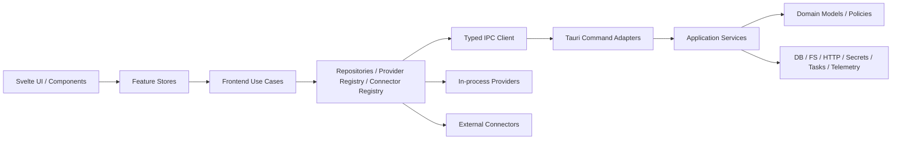

# MoePlay 0.12.1 专项规格：平台架构、数据层、质量/安全/可观测性与发布

> 文档状态：Draft for implementation  
> 审计基线：2026-07-10，Git `3ceb354` 及工作区当时可见内容  
> 目标版本：`0.12.1`  
> 责任范围：`src/lib/api`、`src/lib/stores`、Tauri commands/业务模块/数据库/build.rs/capabilities、测试、脚本、GitHub Actions、更新器与打包发布  
> 约束：本规格采用增量“绞杀式”治理，不要求在补丁版本内重写全部业务功能；所有 P0 项必须在 `v0.12.1` 发布前关闭。

## 1. 结论与发布判定

0.12.1 不应只做版本号升级。当前代码已经具备 SQLite、结构化日志、诊断导出、下载取消/重试、Tauri updater 和较多单元测试，但这些能力彼此分散，缺少统一契约和发布门禁。最需要优先处理的是：

1. **命令清单已经发生可证明的漂移。** `src-tauri/src/lib.rs` 注册 281 个命令，`src-tauri/build.rs` 只声明 274 个；其中 `import_selected_candidates`、`pick_image_file`、`preview_directory_for_games` 已注册且前端可调用，但不在 capability 中，干净构建/运行时存在拒绝调用风险。
2. **数据库迁移失败路径可能删除主库并静默退化。** 当前逻辑复制到固定 `.bak` 后删除 SQLite，随后可能退化到内存库继续运行，数据安全和故障可见性不足。
3. **凭据散落在 localStorage 和明文 settings JSON。** PicACG、Bangumi、Suwayomi/运行时连接、AI 与 Steam API Key 没有统一 secret store，也没有诊断日志脱敏契约。
4. **任务系统有三套以上状态模型。** 通用 `TaskQueue` 只改内存状态；普通下载器和番剧下载器各自维护任务、取消和重试，重启恢复、幂等、统一事件与诊断均缺失。
5. **发布链路没有闭环。** tag release 直接构建发布，不复用 CI 质量门；版本/tag 一致性、Windows Authenticode、更新器升级验收、SBOM/来源证明、旧版本升级测试均未门禁化。

**发布规则：** P0 验收项任一未通过，则不发布 `v0.12.1`；允许降级为 RC 或延后，不允许通过手工修改生成权限、跳过迁移测试或关闭签名校验绕过。

## 2. 审计范围与架构债务证据

### 2.1 前端 API 与 Store

| 证据 | 当前状态 | 风险/影响 | 优先级 |
|---|---|---|---|
| `src/lib/api/index.ts` 共 1,378 行、195 个导出函数 | 游戏、存档、刮削、下载、Steam、模拟器、自启等命令包装集中在一个文件 | 所有领域共享同一变更热点；无法按领域做契约、超时、取消和权限审计 | P1 |
| `src/lib/api/core.ts:35-44` | `invokeCmd<T>(command: string)` 由调用方任意断言返回类型，命令名是裸字符串 | 编译期无法发现命令名、参数名和返回 DTO 漂移；没有统一错误码、trace id、超时和取消 | P0 |
| `src/lib/api/core.ts:12-21` | 测试 mock 是可变全局单例 | 并行测试会互相污染，遗漏 `clear` 时产生顺序依赖 | P1 |
| `src/lib/api/types.ts` 与 Rust `models.rs` | DTO 手工双写 | 字段新增、serde 默认值、可选性和枚举容易漂移 | P0 |
| `src/lib/stores/anime.svelte.ts` 2,019 行、约 99 处 `$state`、12 次 IPC | 同时负责规则、搜索、播放器、源切换、缓存、历史、Bangumi、弹幕、图片搜索、事件监听 | 状态域、I/O 和业务编排耦合；难以隔离取消、错误和测试 | P1 |
| `src/lib/stores/comic.svelte.ts` 979 行、约 48 处 `$state` | 同时定义领域 DTO、Provider 路由、登录、token、列表、详情、阅读器和历史 | Provider 反向依赖 store；凭据与 UI 状态混合 | P0/P1 |
| `src/lib/sources/mangadexProvider.ts:1` 等 | Provider 从 `stores/comic.svelte` 导入 `Comic*` 类型，而 store 又在 `comic.svelte.ts:1-20` 导入 Provider | 形成依赖倒置失败和潜在循环；领域模型无法独立复用 | P0 |
| `comic.svelte.ts:222-229, 369-389`、`anime.svelte.ts:231, 1820-1833` | PicACG/Bangumi token 存 localStorage | WebView 脚本可读、无法统一轮换/撤销/脱敏 | P0 |
| `gameLibrary.svelte.ts:61-65` | 收藏夹配置直接 localStorage 持久化 | 没有 schema/version、迁移和损坏恢复 | P1 |

### 2.2 Tauri 命令、模块边界和生成清单

当前不存在 `src-tauri/src/modules/` 层；业务模块平铺在 `src-tauri/src/`，命令适配层位于 `src-tauri/src/commands/`。拆文件已有进展，但边界仍不稳定：

- `src-tauri/src/lib.rs:120-442` 维护超长 `generate_handler!`；`build.rs` 又手工维护第二份命令清单，capability 再维护第三份。
- `src-tauri/src/commands/platform.rs` 2,005 行，既包含 Tauri command，也包含 Steam 文件扫描、VDF 解析、Web/API、图片下载/复制、去重合并和导入事务。
- `src-tauri/src/commands/anime.rs` 856 行、47 个命令；`src-tauri/src/anime.rs` 2,048 行，混合规则解析、图片代理、GitHub 规则、Bangumi、trace.moe、弹幕等多个外部系统。
- Rust 源码中约 598 处 `Result<..., String>`，其中 command 层约 246 处。前端大量 `String(e)`，无法区分可重试、鉴权、限流、离线、校验失败和内部错误。
- `src-tauri/src/lib.rs:2` 全局允许 `clippy::too_many_arguments`，掩盖命令 DTO 和 use-case 参数对象缺失。

#### 命令契约漂移快照

| 集合 | 数量 | 差异 |
|---|---:|---|
| `generate_handler!` 实际注册 | 281 | 运行时入口事实来源 |
| `build.rs` `COMMANDS` | 274 | 缺 `anime_get_source_health`、`anime_record_source_health`、`anime_verify_rule_webview`、`get_video_proxy_port`、`import_selected_candidates`、`pick_image_file`、`preview_directory_for_games` |
| default + sensitive capability 自定义 allow | 278 | 缺 `import_selected_candidates`、`pick_image_file`、`preview_directory_for_games` |
| 前端 `src/lib/api/index.ts:790-802` | 已调用后 3 个命令 | 当前能力配置可直接造成用户功能不可用 |

这不是文档问题，而是 **P0 可执行契约缺陷**。0.12.1 必须将命令注册、权限生成和前端类型映射收敛到单一清单，并在 CI 中做集合相等检查。

### 2.3 数据库与缓存

| 证据 | 当前状态 | 风险/影响 | 优先级 |
|---|---|---|---|
| `db.rs:37-55` | 迁移失败后复制为固定 `moegame.db.bak`，删除原库，失败时可能使用内存库继续运行 | 备份覆盖、WAL 未一致复制、主库被删除、用户误以为数据已持久化 | P0 |
| `db.rs:87-100` | 查询/导出错误用 `unwrap_or_default()` 静默转为空库/默认设置 | 数据库错误被表现为“没有数据”，可能触发错误覆盖或误操作 | P0 |
| `db_sqlite.rs:15-20, 229` | 单个 `Mutex<Connection>` 串行全部读写；同步 DB 方法可由 command 直接调用 | 大库、导入、迁移期间阻塞 IPC；无连接池/`spawn_blocking` 边界 | P1 |
| `db_sqlite.rs:19-20` 与 `migration.rs:15-16` | SQLite schema version 为 2，旧 JSON schema version 为 1，两套迁移机制并存 | 版本含义不统一，无法从应用版本判断已执行迁移 | P0 |
| `db_sqlite.rs:227-280` | 建表/补列/索引后直接把版本更新到最新，没有 migration id/checksum 历史 | 中途失败、重复执行、分支合并和审计困难 | P0 |
| `db_sqlite.rs:233-250` | 启用 WAL/foreign keys，但没有显式 `busy_timeout`、`synchronous`、启动 integrity check | 锁竞争和损坏诊断策略不明确 | P1 |
| `db_sqlite.rs:3-9` | 主体仍是投影列 + 全量 `data_json` | 每次局部修改重写整个 Game；关系查询和增量迁移受限 | P2，0.12.1 只建立演进边界 |
| `scraper/cache.rs:18-80` | 内存 HashMap + 固定 TTL，无条目/字节上限，锁 poison 使用 unwrap；启动时 `lib.rs:82-86` prune 新建内存缓存几乎无效 | 重启即丢失，无法观测命中率，异常时可能 panic | P1 |
| `lib.rs:455-460` | 缩略图/图片缓存有独立清理策略，番剧前端另有 30 分钟视频 URL cache | 缓存命名、TTL、容量、清理、隐私和诊断各自为政 | P1 |
| `performance.rs:24-27` | 仍统计 `database.json` 和当前工作目录 `target` | 性能快照数据库大小可能一直为 0，生产环境 target 指标无意义 | P0 |

### 2.4 任务、取消与重试

- `task_queue.rs:29-103` 只是 `Mutex<Vec<AppTask>>`，取消仅把状态写成 `Cancelled`，没有执行句柄或 cancellation token；任务不持久化、无状态机校验、无重试策略。
- `downloader.rs:123-153`、`anime_download.rs:236-254` 分别维护独立 `tasks`、`controls`、并发控制和状态枚举；普通下载器有重试，番剧下载器无同等重试接口。
- 取消使用 `AtomicBool` 轮询，命令返回只代表“已写取消标志”，不代表网络/文件句柄已停止。
- 应用退出后任务、attempt、错误和部分文件恢复信息全部丢失；无法回答“为什么失败”“是否可重试”“取消是否生效”。

### 2.5 日志、诊断与健康度

| 证据 | 当前状态 | 风险/影响 | 优先级 |
|---|---|---|---|
| `logging.rs:26-28` | 注释声称保留 7 天，但仅创建 daily appender，没有删除旧文件 | 日志可无限增长；声明与实现不一致 | P0 |
| `logging.rs:28,49-50` | 通过 `mem::forget` 保活 non-blocking guard | 可工作但生命周期不可测试，关闭时不保证 flush | P1 |
| `lib.rs:55-71` | 另有独立 `crash.log` 写入路径 | 日志格式、轮转、脱敏和关联 id 分裂 | P1 |
| `diagnostics.rs:279-280` | 直接把最近 200 行日志写入 ZIP | token、URL query、用户路径或文件名可能泄露；没有 redaction 测试 | P0 |
| `diagnostics.rs:272-306` | 使用固定临时目录 `moegame_diag` | 并发导出互相覆盖；异常退出残留 | P1 |
| `diagnostics.rs:75-89` | source 列表硬编码；健康仅看内存/磁盘/LE/游戏数 | 无 DB integrity、migration、queue、cache、provider/connector、updater/签名健康 | P1 |
| `commands/anime.rs:333-357` | 已有动漫源健康记录，但未纳入统一诊断 | 局部能力无法形成平台健康视图 | P1 |

默认要求 **本地可观测、默认不上传遥测**。0.12.1 不引入未经用户明确同意的远程 telemetry。

### 2.6 权限、路径、网络与 secrets

- `capabilities/default.json` 有 281 项权限，`sensitive.json` 有 19 项，两个 capability 都作用于 `main` 窗口；需要通过单一清单保持完整性，并按风险级别审计，而不是依赖人工同步。
- `tauri.conf.json:27` 的 CSP 允许任意 `https:` 图片/连接、任意 `http/https` media 和 frame；`assetProtocol.scope` 在 `tauri.conf.json:30` 覆盖整个 Documents/Pictures/Downloads 与 `$APPLOCALDATA/**`，超出最小权限。
- `commands/system.rs:64-65` 的 `open_url` 没有 scheme/host 策略；必须拒绝 `file:`、`javascript:`、自定义协议滥用和携带凭据 URL。
- `commands/system.rs:69-95` 已有路径作用域校验，是可复用基础；但其他 commands 仍各自 `PathBuf::from`、`scope.allow`，需要集中到统一的 `PathPolicy`，并覆盖 symlink/junction、UNC、ADS、TOCTOU 和归档解压路径。
- `http_client.rs:8-35` 支持 `MOEGAME_INSECURE_TLS=1` 关闭证书校验。发布构建必须禁用或显示 Critical health；不能让普通生产环境静默进入不安全 TLS。
- Provider/视频代理/远程连接允许用户或网页提供 URL，必须建立 SSRF 策略：重定向每跳重验、默认阻断 loopback/private/link-local/metadata IP；仅 Connector 的显式“本机服务”模式允许 loopback，且不允许把认证头跨 origin 转发。
- `models.rs:752-813` 的 `Settings` 包含 `ai_api_key`、`steam_api_key`，`db_sqlite.rs:1432-1441` 将完整 settings 明文 JSON 写入 SQLite；同时 PicACG/Bangumi/Suwayomi 等 token 还在 localStorage。应拆分 public config 与 secret reference。
- release workflow 使用 GitHub secret 注入 updater 私钥是正确方向，但没有私钥轮换、最小环境权限、签名指纹校验和 Windows 代码签名流程。

### 2.7 测试、CI 与发布现状

- 当前约有 **159 个前端测试用例、118 个 Rust 测试**，基础数量可观；但缺少跨 IPC 的自动契约测试、数据库历史 fixture 升级、真实 Tauri E2E、更新器升级和安全策略测试。
- `tests/visual/*` 通过注入 `__TAURI_INTERNALS__.invoke` 模拟命令，是浏览器级 E2E/视觉烟测，不是实际 Tauri/Rust 集成测试。
- `liveAcceptance.test.ts:7,56` 仅在 `MOEPLAY_LIVE_TESTS=1` 时运行，当前 CI 未开启；真实源验收不构成发布门禁。
- `ci.yml` 的 Tauri build、portable 和 artifact verify 只在 push 运行，不覆盖 PR；release workflow 在 tag 上直接 `tauri-action`，没有先执行 fmt/clippy/test/check/E2E。
- `playwright.config.ts:18` 固定 `channel: "chrome"`，CI 却安装 Chromium；环境契约不一致。
- release 使用 Node `lts/*`，CI 使用 Node 20；可重复性不足。
- `verify-release-artifacts.ps1:14-24` 选择目录中“最新”通配产物，若 target 未清理可能把旧版本文件当作本次产物；且未校验 updater `.sig`、`latest.json` 内容与签名。
- `tauri.conf.json:49,52-56` 已启用 updater artifact 和公开 key，`release.yml:37-48` 生成 updater JSON；但没有从 0.12.0 安装包升级到 0.12.1 的自动验收，也没有 Windows Authenticode 配置。

## 3. 目标架构与模块边界

### 3.1 依赖方向



强制规则：

1. UI 组件不得直接 `invokeCmd`、`fetch` 或读写 secrets。
2. Store 只管理 feature state 和调用 use case；不得定义 Provider 共享 DTO、解析 HTML、构建认证头或决定路径权限。
3. Provider/Connector 只能依赖 `platform/contracts`，不得导入任何 store/component。
4. Rust command 只做反序列化、鉴权/权限上下文、调用 application service、映射 `AppError -> CommandError`；不得承载大段扫描/解析/下载逻辑。
5. 数据库、文件系统、网络、secret store、任务执行和日志都是 infrastructure port；领域/use-case 通过 trait 使用。
6. 命令名称、参数、返回值、风险等级和 capability 从一个 manifest 生成或校验，禁止三份手工清单。

### 3.2 建议目录（增量落地）

```text
src/lib/platform/
  contracts/          # DTO、CommandMap、Provider/Connector 契约、错误码
  ipc/                # invokeClient、trace、timeout、abort、mock transport
  providers/          # registry + provider adapters
  connectors/         # registry + connection/session adapters
  repositories/       # feature-facing repositories
  config/             # public config schema；只保存 secretRef
  observability/      # frontend logs/health/event correlation

src/lib/features/<feature>/
  store.svelte.ts     # feature state
  useCases.ts
  selectors.ts

src-tauri/src/platform/
  command_contract.rs
  error.rs
  config.rs
  secrets.rs
  path_policy.rs
  network_policy.rs
  telemetry.rs
  health.rs

src-tauri/src/application/
  library/ anime/ comic/ import/ download/ sync/ diagnostics/

src-tauri/src/infrastructure/
  db/ migrations/ cache/ http/ fs/ updater/ task/

src-tauri/src/commands/
  # 保留现有领域文件，但每个 command 仅作 adapter；逐步迁出业务逻辑
```

0.12.1 不要求一次性移动全部文件。新增能力必须遵守新边界；旧代码在触达时逐步迁移。优先拆 `comic` 共享类型、命令契约、DB migration、secret、task 和 diagnostics。

## 4. Typed IPC、错误模型与命令清单

### 4.1 前端命令映射

`invokeCmd<T>(string)` 改为按命令键推导参数和返回值：

```ts
export interface CommandMap {
  get_games: { args: undefined; result: Game[] };
  preview_directory_for_games: {
    args: { dir: string };
    result: ImportCandidate[];
  };
  cancel_task: { args: { id: TaskId }; result: TaskSnapshot };
}

export interface CommandError {
  code:
    | "validation"
    | "not_found"
    | "permission_denied"
    | "auth_required"
    | "rate_limited"
    | "network_offline"
    | "timeout"
    | "cancelled"
    | "conflict"
    | "migration_failed"
    | "internal";
  message: string;
  retryable: boolean;
  traceId: string;
  details?: Record<string, unknown>; // 必须已脱敏
}
```

`invokeClient.call<K>()` 统一提供：默认 timeout、可选 `AbortSignal`、trace id、命令耗时、错误映射和测试 transport。mock 由每个 test 创建实例，不再使用全局 handler。

### 4.2 单一命令 manifest

建立一份机器可读 manifest，至少包含：

```text
name, rust_handler, args_type, result_type, risk(low|sensitive), capability,
timeout_class, cancellable, owner_domain, deprecated_since
```

实现可以是 Rust 宏/静态表生成 build manifest，也可以由脚本解析并验证，但 CI 必须证明以下集合完全相等：

- `generate_handler!` 注册集合；
- `build.rs` app manifest commands；
- capability 自定义 allow 集合；
- 前端 `CommandMap` 集合（允许标注 backend-only）；
- autogenerated permission 文件集合。

P0 立即修复 7 个 build.rs 缺项和 3 个 capability 缺项；随后禁止手工“只改一处”。

## 5. Provider / Connector 统一接口

### 5.1 语义

- **Provider：** MoePlay 内部拥有的、面向内容源的无状态/轻状态适配器，例如 MangaDex、Baozi、DM5、Bangumi 搜索、VNDB 刮削。负责把外部协议归一化为领域 DTO，不负责 UI 状态或 secret 持久化。
- **Connector：** 连接外部运行时、账户或本地服务的生命周期对象，例如 Suwayomi、Komga、LANraragi、Steam 账户/Web API、WebDAV。具有配置、探测、认证、能力协商、同步和断开语义。

### 5.2 契约

```ts
export type Capability =
  | "search" | "detail" | "chapters" | "assets" | "playback"
  | "library-read" | "library-write" | "sync" | "download";

export interface OperationContext {
  traceId: string;
  signal: AbortSignal;
  locale: string;
  network: NetworkGateway;
  cache: CacheGateway;
  now(): number;
}

export interface Provider<Q, S, D> {
  readonly id: string;
  readonly version: string;
  readonly capabilities: ReadonlySet<Capability>;
  search(query: Q, ctx: OperationContext): Promise<Page<S>>;
  getDetail(id: string, ctx: OperationContext): Promise<D>;
  health(ctx: HealthContext): Promise<ProviderHealth>;
}

export interface ChapterProvider<C, A> {
  listChapters(id: string, ctx: OperationContext): Promise<C[]>;
  getAssets(chapterId: string, ctx: OperationContext): Promise<A[]>;
}

export interface Connector<Cfg, Session> {
  readonly id: string;
  normalizeConfig(input: unknown): PublicConnectorConfig<Cfg>;
  probe(config: PublicConnectorConfig<Cfg>, ctx: OperationContext): Promise<ConnectorProbe>;
  connect(config: PublicConnectorConfig<Cfg>, secret: SecretRef | undefined, ctx: OperationContext): Promise<Session>;
  capabilities(session: Session): Promise<ReadonlySet<Capability>>;
  disconnect(session: Session): Promise<void>;
  health(session: Session | undefined, ctx: HealthContext): Promise<ConnectorHealth>;
}
```

约束：

1. DTO 移到 `platform/contracts/media`，先消除 Provider 导入 `comic.svelte` 的反向依赖。
2. Provider 不接收裸 `fetch`，只接收执行过 SSRF/TLS/timeout/redirect 策略的 `NetworkGateway`。
3. Connector public config 可持久化；password/token/api-key 只以 `SecretRef` 存储，调用时从 Rust secret store 取回。
4. `health` 返回统一状态：`healthy | degraded | auth_required | rate_limited | offline | incompatible | disabled`，附 `lastSuccessAt`、延迟、错误码和下次探测时间，不包含 secret 或完整 URL query。
5. Provider 失败彼此隔离；聚合搜索使用有界并发，单源超时不阻塞整体结果。

## 6. 数据层：迁移、事务、备份与缓存

### 6.1 迁移框架

新增 `schema_migrations`：

```sql
CREATE TABLE schema_migrations (
  id TEXT PRIMARY KEY,
  checksum TEXT NOT NULL,
  app_version TEXT NOT NULL,
  applied_at TEXT NOT NULL,
  duration_ms INTEGER NOT NULL
);
```

迁移对象包含 `id/checksum/up/preflight`，按固定顺序执行。要求：

- 每个 migration 在显式事务内执行；成功提交后才写入记录。
- 启动先执行 `PRAGMA quick_check`、检查 schema/checksum，再决定是否迁移。
- 迁移前使用 SQLite backup API 或 `VACUUM INTO` 生成带时间戳、应用版本和 schema 版本的原子备份；WAL 模式下不能只复制主 `.db`。
- 迁移失败时 **不得删除主库、不得自动进入可写内存库**。应用进入 recovery/read-only 模式，展示 trace id、备份位置、重试和导出诊断入口。
- 固定保留最近 3 个迁移备份；只有迁移成功且 quick check 通过后才按策略清理。
- 旧 JSON 导入作为一次性 import migration 记录；JSON schema 与 SQLite schema 不再共享含义模糊的数字常量。
- 所有 DB 错误向上返回结构化错误，禁止 `unwrap_or_default` 把故障伪装成空库。

0.12.1 至少提供 fixture：空库、当前 0.12.0 schema、旧 settings `value` 列、旧 games `install_path NOT NULL`、旧 JSON、损坏 DB、migration 中断模拟。

### 6.2 访问模型

- SQLite I/O 放入专用 blocking executor；command async runtime 不直接执行长时间同步 DB/目录遍历。
- 0.12.1 可继续单连接，但必须设置 `busy_timeout`、明确 `journal_mode=WAL`、`synchronous=NORMAL`、`foreign_keys=ON`，并记录 open/migration/query 慢日志。
- 批量导入、replace/export 使用事务和 chunk，提供进度与取消检查。
- `game_count/list/search` 不吞错误；UI 维护 `loading/error/data` 三态，数据库错误不能变成空数组。
- 未来关系化拆表通过 repository 隔离，0.12.1 不要求重写所有 `data_json`。

### 6.3 缓存策略

统一 `CacheGateway`，分层：

- L1：进程内有界 LRU，按条目数和字节数限制；锁错误返回 health，不 panic。
- L2：`cache_entries(namespace,key,payload,etag,last_modified,expires_at,last_accessed_at,size_bytes,schema_version)` 或受控文件缓存。
- metadata/search 默认 TTL 1 小时，支持 stale-while-revalidate；认证结果、用户私有库和含 token URL 默认不缓存。
- 图片/缩略图按内容 hash 命名，原始 URL 只存脱敏 hash；视频临时 URL 最长 30 分钟且不持久化。
- 统一清理策略、命中率、淘汰数、当前字节数；缓存损坏可独立清空，不影响主库。
- 预算：metadata 100 MiB、缩略图 512 MiB、动漫代理图默认 1 GiB（允许配置，上限 2 GiB）、日志 100 MiB/7 天，先到者触发清理。

## 7. 任务队列、取消、重试与恢复

新增统一 `TaskService`/`TaskRegistry`，先接管通用任务、普通下载和番剧下载的“控制面”，执行器可继续复用现有实现。

### 7.1 状态机

```text
queued -> running -> succeeded
              |----> failed(retryable/non-retryable)
              |----> cancelling -> cancelled
queued/running/failed -> paused -> queued/running
failed(retryable) -> retry_wait -> queued
```

禁止任意状态直接覆盖。任务记录至少包含：`id`、`kind`、`payload_version`、`state`、`progress`、`attempt`、`max_attempts`、`next_retry_at`、`idempotency_key`、`parent_id`、`created/started/finished`、`error_code`、`trace_id`、可恢复 checkpoint。

### 7.2 执行规则

- 统一使用 cancellation token；`cancel` 返回 `accepted`，任务到 `cancelled` 后再发完成事件。取消确认 P95 <= 500 ms，网络/文件活动停止 P95 <= 2 s。
- retry 只针对 timeout、连接重置、429/5xx 等可重试错误；鉴权、校验、权限、路径和 4xx 业务错误不自动重试。
- 默认指数退避 + jitter：1s、2s、4s，最多 3 次；尊重 `Retry-After`；每个 Provider/Connector 可收紧但不能无限重试。
- 幂等键防止重复导入、重复写库和重复下载；重试从安全 checkpoint 恢复，临时文件使用 `.part` 后缀并原子 rename。
- 应用重启时：`running/cancelling` 转为 `interrupted`，可恢复任务回到 queued，不可恢复任务明确失败；不静默消失。
- task 事件统一为 `task://created|updated|finished`，包含 task id/trace id，不发送 secret 或完整 header。

## 8. 日志、诊断、健康度与隐私

### 8.1 日志

- 单一 tracing 初始化；guard 存入应用生命周期对象，正常退出 flush，不再依赖 `mem::forget`。
- 字段标准：`timestamp, level, target, event, trace_id, command, task_id, provider_id, connector_id, duration_ms, error_code`。
- 每个 IPC 调用、Provider/Connector 操作和 task attempt 继承 trace id。
- 建立 `Redactable`/redaction 层：屏蔽 Authorization、Cookie、token、password、api key、URL query、用户目录、SteamID/邮箱等；只允许白名单字段进入 diagnostics。
- 实现实际的 7 天/100 MiB 轮转清理；panic/crash 也进入相同策略。若保留 emergency crash log，内容只含 crash id、时间、版本，不含业务参数。

### 8.2 健康快照

`get_health_snapshot` 返回：

- app/version/build channel；
- DB open、quick_check、schema/migration、WAL 大小；
- cache size/hit rate/last prune；
- queue depth/running/failed/interrupted；
- Provider/Connector 最近成功、P95 latency、auth/rate-limit 状态；
- updater endpoint reachability、签名 key fingerprint、最后检查结果；
- disk free、日志目录可写、下载目录可写；
- insecure TLS、recovery mode、secret backend availability。

状态分 `ok/degraded/critical/disabled`。健康检查必须有超时，不允许因为某个外部源阻塞诊断页面。

### 8.3 诊断导出

- 使用随机临时目录；`Drop`/finally 清理；导出前展示将包含的类别。
- 默认包含脱敏 health、版本、schema、任务摘要、最近结构化错误、日志统计；不包含数据库正文、token、cookie、完整用户路径和媒体 URL。
- `recent.log` 必须经过 redaction；加入专门测试，向日志注入假 token/password/path 后断言 ZIP 中不存在原值。
- 修正 `performance.rs` 统计 `moegame.db + -wal + -shm`，删除生产 `target_dir_size` 指标；增加启动、IPC、DB、source latency 的窗口统计。

## 9. 权限、路径与网络安全

### 9.1 Capability

- 修复当前命令集合差异，并增加 `verify-command-contract` 脚本作为 PR 必过门。
- capability 按 `core-read`、`library-write`、`filesystem-sensitive`、`network-auth`、`process-launch`、`updater` 分组；每项命令只有一个风险 owner。
- `main` 窗口需要的敏感能力仍可显式授予，但业务层必须执行参数校验和用户意图校验；capability 不是输入验证替代品。
- 删除 stale autogenerated permission；生成结果必须在 clean checkout 可重复且 `git diff --exit-code`。

### 9.2 PathPolicy

- 所有文件命令通过统一 API：`resolve_existing_file/dir`、`resolve_new_file_under`、`resolve_app_asset`、`resolve_user_selected_path`。
- 用户选择目录后返回短期 scope token，而不是永久扩大 asset scope；scope token 绑定 canonical path、命令类别和过期时间。
- 阻断 `..`、symlink/junction 越界、UNC（除非明确允许）、Windows device path、ADS、保留设备名、大小写/规范化绕过。
- 归档解压逐 entry 校验目标路径、条目数、解压总字节、压缩比；防 zip-slip/zip bomb。
- 缩小 asset protocol 到应用拥有的 covers/thumbnails/cache 目录；Documents/Pictures/Downloads 不应整体暴露为 asset URL。

### 9.3 NetworkPolicy

- 默认只允许 `https`；确需 `http` 的媒体源/本地 Connector 必须按 source id 显式声明。
- URL 拒绝用户名/密码段、非 http(s) scheme、超长 host/path、控制字符；每次 redirect 重新校验。
- 远程 Provider 默认阻断 private/loopback/link-local/multicast/云 metadata 地址；本地 Connector 只允许用户明确配置的 loopback/局域网范围。
- auth header 不跨 origin 重定向；Referer/Cookie 由 connector policy 白名单控制。
- 统一 connect/read/overall timeout、最大响应体、内容类型检查和下载配额。
- 生产构建禁用 `MOEGAME_INSECURE_TLS`；开发模式开启时 UI 和 health 显示 Critical banner。
- `open_url` 仅允许 `https/http` 以及经过白名单的应用协议；外部打开前去除/拒绝凭据和危险 scheme。
- 收紧 CSP；若动漫网页模式必须 `frame-src http/https`，按独立 webview/窗口 capability 隔离，不与主窗口共享高风险命令。

## 10. 配置与 Secrets

配置分三层：

1. **BuildConfig：** channel、updater endpoint、public signing fingerprint、feature flags；编译期只读。
2. **PublicAppConfig：** theme、language、source enable、proxy address、download/cache budget；SQLite 可持久化、可导出。
3. **Secrets：** AI key、Steam key、Bangumi/PicACG/Suwayomi token、WebDAV password；存 Windows Credential Manager/系统 keyring，SQLite/localStorage 只保存 `secretRef` 和最后验证时间。

迁移要求：

- 首次 0.12.1 启动从 localStorage/旧 settings 读取旧 secret，经 Rust command 写入 keyring，成功后删除旧值；迁移幂等并记录不含值的状态。
- 如果 keyring 不可用，不回退到明文静默保存；允许用户选择“仅本次会话”，并在 health 中 degraded。
- `get_settings` 不再把 secret 返回前端；提供 `secret_status`（configured/lastValidated）和一次性 `set/delete/test_secret` 命令。
- 所有配置经过 schema 校验；proxy/API URL/connector host 走 NetworkPolicy。
- CI/release secret 只存在 GitHub environment，开启 required reviewers；不得打印 env。私钥轮换需同时发布新 public key 过渡方案。

## 11. 测试与验收矩阵

### 11.1 单元测试

**前端：**

- typed command client：参数、结果解析、timeout、abort、错误映射、trace；
- Provider/Connector normalization、capability、health、聚合隔离；
- Store 只测试状态转移，I/O 通过 repository fake；
- secret migration 不泄露到 localStorage/diagnostics；
- coverage 门：平台新增代码 statement/branch >= 85%/75%，全仓不得低于合入前基线。

**Rust：**

- `AppError` 到 `CommandError`；PathPolicy/NetworkPolicy 边界和 fuzz/property cases；
- task 状态机、退避、幂等、取消竞态、重启恢复；
- cache TTL/容量/LRU/损坏恢复；
- log redaction；
- migration 每个 step 的 up/preflight/checksum。

### 11.2 集成测试

- SQLite fixture 从旧版本升级，逐库执行 quick_check、行数/关键字段/设置一致性比较；
- 模拟 migration 中途失败，确认原库未删除、备份可恢复、应用进入 read-only；
- DB 并发读写、busy timeout、批量导入取消；
- 下载 HTTP test server：Range、429 Retry-After、5xx、断连、重定向、取消、恢复、校验失败；
- secret backend fake + Windows keyring smoke；
- command manifest/capability/TS CommandMap 集合契约；
- diagnostics ZIP 注入敏感假数据后做负向扫描。

### 11.3 E2E

分两层：

1. **浏览器 mock E2E（PR 必跑）：** 保留现有 Playwright，覆盖首屏、漫画多源、番剧播放失败切源、任务取消、诊断 UI、更新提示。明确命名为 `e2e-web-mock`，不宣称 Rust 已覆盖。
2. **真实 Tauri E2E（merge/release 必跑）：** 启动编译后的 app，使用临时 data dir，完成导入 fixture、SQLite 写入/重启读取、敏感 command、下载取消、诊断导出和 updater mock server 流程。

Playwright 使用 bundled Chromium 或 Chrome 二选一并统一配置；CI 安装项与 `channel` 必须一致。

### 11.4 契约测试

- 命令五集合相等；
- TypeScript DTO 与 Rust serde fixture 双向 roundtrip；
- Provider contract suite：search/detail/chapter/health/cancel/error normalization；
- Connector contract suite：normalize/probe/connect/capabilities/disconnect/secretRef；
- updater `latest.json` schema、version、platform URL、signature 字段与实际产物一致；
- public config schema 向后兼容，未知字段处理有定义。

### 11.5 真实源验收

真实源测试不在每个 PR 上阻塞，放在 nightly 与 release-candidate：

- 漫画：至少 2 个独立源完成 search -> detail -> chapters -> 首图可读；当前 `liveAcceptance.test.ts` 扩展为契约 runner。
- 番剧：至少 2 个独立规则完成 search -> roads -> episode URL/extraction；不要求长时间播放，但需验证媒体响应和取消。
- 元数据：VNDB/Bangumi/Steam 等至少 2 个公共源完成搜索/详情；需凭据的路径使用专用测试账号 secret，日志不可出现值。
- Connector：Suwayomi/Komga 等使用本地容器或 mock runtime 做稳定验收；外部真实实例作为非阻塞观测。
- 每个源独立超时、最多一次验收重试；报告 source id、阶段、延迟、错误码，不记录完整 URL/token。
- RC 阻塞条件：核心媒体类别不能达到“至少两个独立可用源”，或所有健康结果来自同一上游生态。

## 12. CI 门禁

### 12.1 Pull Request 必过 jobs

1. `contract-gate`：命令/capability/生成权限/DTO/version 扫描，clean generation diff 为 0。
2. `frontend-gate`：Node 固定版本、`npm ci`、Svelte check、unit + coverage、production build、bundle budget。
3. `rust-gate`：固定 Rust toolchain、fmt、clippy `-D warnings`、tests、平台新增代码 coverage 基线。
4. `migration-security-gate`：历史 DB fixtures、Path/Network/secret/redaction tests、dependency license/advisory scan。
5. `e2e-web-mock`：统一浏览器，上传 trace/screenshot/report。
6. `tauri-build-smoke`：对影响 `src-tauri/**`、capabilities、package/lock/config 的 PR 构建 Windows debug/release smoke；不能只在 push 后发现失败。

Actions 使用 commit SHA 固定版本；Node/Rust 与 release 完全一致；启用 npm/cargo 缓存但 cache key 包含 lockfile。

### 12.2 Main/nightly

- 真实源 acceptance；
- 真实 Tauri E2E；
- 10k 游戏性能基准；
- dependency/advisory/SBOM；
- 长时间任务取消/重试 soak；
- 失败允许标记外部源 degraded，但必须生成 issue/报告，不能静默忽略。

### 12.3 Release gate

Tag workflow 不直接跳到发布。顺序必须是：

`version/tag check -> all quality jobs -> clean build -> sign -> artifact verify -> install/upgrade smoke -> draft release -> promote latest.json -> publish release`。

任何 job 失败都不能上传/覆盖 `latest.json`。

## 13. 0.12.1 版本一致性、构建签名与发布

### 13.1 版本单一来源

目标值统一为 `0.12.1`：

- `package.json`；
- `package-lock.json` 顶层与 root package；
- `src-tauri/Cargo.toml`；
- `src-tauri/Cargo.lock` 中 workspace package；
- `src-tauri/tauri.conf.json`；
- `CHANGELOG.md`；
- Git tag 必须严格为 `v0.12.1`；
- updater `latest.json.version` 必须为 `0.12.1`。

新增 `verify-version`，从一个 canonical version 读取并比较以上位置。扫描代码中的 `MoePlay/0.12.0`、`MoeGame/0.1`、`MoeGame/1.0` 等 User-Agent 常量；运行时代码统一由 `app_user_agent(env!("CARGO_PKG_VERSION"))`/前端构建常量生成，历史 changelog/fixture 可白名单。产品显示名 `MoePlay`/`MoeGame` 的品牌差异另立清单，至少保证包名、identifier、数据目录和更新 endpoint 不随补丁版本意外变化。

### 13.2 签名与产物

- updater minisign 私钥只来自受保护 GitHub environment；验证配置 public key fingerprint 与预期一致。
- 增加 Windows Authenticode，对 `moeplay.exe`、NSIS 和 MSI 签名并验证时间戳；若 0.12.1 尚无正式证书，必须在 release note 明示且将“获取证书”列为发布阻塞决策，而不能把 updater 签名误称为 Windows 代码签名。
- 清理 target 后构建，按精确路径/版本收集：主 exe、MSI、NSIS、portable、updater archive、`.sig`、`latest.json`。
- 生成 SHA-256 manifest、CycloneDX/SPDX SBOM、构建元数据（commit/toolchain/runner）、GitHub artifact attestation/provenance。
- `verify-release-artifacts.ps1` 不再选择“最新通配文件”，而是验证本次 commit/version 的精确产物；校验 PE/installer 签名、updater signature、latest.json URL/hash/version、portable 内容和最小/最大尺寸。
- release action 固定 SHA；release 先 draft，安装/升级烟测通过后再发布并更新 latest。

### 13.3 更新器验收

- 从已发布的签名 `0.12.0` 安装包启动，检查 `0.12.1`，下载、验签、安装、重启；确认数据、settings、secrets reference、任务记录和 schema 均保留。
- 测试断网、下载中断、signature 错误、latest.json 版本不匹配、磁盘不足；失败不得破坏当前安装。
- 禁止降级安装自动覆盖较新 schema。回滚采用暂停 latest、恢复旧安装下载并发布前向 hotfix；数据库迁移必须保持前一版本可读或提供备份恢复。

## 14. 性能预算

基准环境固定为 Windows CI/参考机，数据集含 1k 与 10k 游戏、500 条历史任务、常见缓存规模。先记录 0.12.0 baseline，再执行以下门禁：

| 指标 | 0.12.1 预算 |
|---|---|
| 冷启动到 app shell 可交互，1k 游戏 | P95 <= 2.5 s，且不比 baseline 退化 > 10% |
| 冷启动到库列表稳定，10k 游戏 | P95 <= 4.0 s |
| DB open + 无迁移启动 | P95 <= 250 ms |
| 0.12.0 -> 0.12.1 migration，10k 游戏 | <= 30 s，有进度，UI 不假死 |
| 游戏搜索，10k 数据 | P95 <= 150 ms |
| 单游戏更新事务 | P95 <= 50 ms；P99 <= 150 ms |
| typed IPC 自身开销（不含业务 I/O） | P95 <= 25 ms |
| 聚合搜索首批结果 | 任一健康源 <= 1.5 s；整体超时 <= 15 s |
| cancel 接受/实际停止 | P95 <= 500 ms / <= 2 s |
| 空闲 RSS，主窗口 + 1k 库 | <= 300 MiB，且不比 baseline 增长 > 10% |
| 前端首屏 JS gzip | 不比 baseline 增长 > 5%，目标 <= 1.5 MiB |
| installer/portable 大小 | 单版本增长 <= 5%，超出需记录原因和批准 |
| 日志开销 | 正常 info 模式 CPU < 2%，不阻塞主线程 |
| 日志/缓存磁盘 | 遵守第 6.3 节硬上限，清理后降至 80% 以下 |

性能测试失败不能用扩大阈值直接解决；需附 profile、原因和批准的临时豁免，豁免不得跨越 0.12.1 GA。

## 15. 任务拆分

| ID | 优先级 | 任务 | 主要产物 | 依赖 | 验收摘要 |
|---|---|---|---|---|---|
| PQ-01 | P0 | 命令清单收敛与当前漂移修复 | manifest/check 脚本、7/3 缺项修复 | 无 | 五集合相等，clean build 生成无 diff |
| PQ-02 | P0 | Typed IPC 与结构化 CommandError | `CommandMap`、client、Rust error envelope | PQ-01 | 新平台命令无裸字符串/`String(e)` |
| PQ-03 | P0 | Comic DTO 抽离、Provider/Connector contract | `platform/contracts`、registry、contract tests | PQ-02 | Provider 不再导入 store |
| PQ-04 | P1 | Anime/Comic store 按 use-case 拆分 | feature stores/repositories | PQ-03 | store 不直接解析协议/持久化 secret |
| PQ-05 | P0 | Migration runner 与 recovery mode | migration table、backup、fixtures、UI 状态 | 无 | 失败不删库、不进可写内存库 |
| PQ-06 | P0 | 删除 DB 静默默认 | 结构化 DB 错误、UI error state | PQ-02/PQ-05 | DB 故障不显示为空库 |
| PQ-07 | P1 | DB blocking/pragma/慢查询治理 | executor、busy timeout、metrics | PQ-05 | 并发与性能预算通过 |
| PQ-08 | P1 | 统一 cache gateway/预算 | L1/L2、清理、health | PQ-07 | TTL/容量/损坏测试通过 |
| PQ-09 | P0 | 统一 TaskService 控制面 | 状态机、持久任务表、事件 | PQ-05/PQ-02 | 通用/两类下载可统一观测 |
| PQ-10 | P0 | 取消/重试/恢复语义 | token、retry policy、checkpoint | PQ-09 | 取消和重启恢复预算通过 |
| PQ-11 | P0 | 日志 redaction 与实际轮转 | tracing lifecycle、redactor、retention | PQ-02 | 假 secret 不出现在日志/ZIP |
| PQ-12 | P1 | Health/diagnostics v2 | health snapshot、随机临时导出 | PQ-05/PQ-08/PQ-09/PQ-11 | DB/cache/task/source/updater 可诊断 |
| PQ-13 | P0 | PathPolicy/NetworkPolicy/open_url | 集中策略与安全测试 | PQ-02/PQ-03 | traversal/SSRF/redirect/scheme 测试通过 |
| PQ-14 | P0 | Secret store 与旧值迁移 | keyring、secretRef、迁移命令 | PQ-05/PQ-13 | localStorage/DB 不再保存明文凭据 |
| PQ-15 | P0 | Capability 最小化与生成校验 | capability 分组、CI gate | PQ-01/PQ-13 | 敏感命令都有 owner/校验 |
| PQ-16 | P0 | 历史 DB/IPC/安全集成测试 | fixtures、contract suite | PQ-02/PQ-05/PQ-13/PQ-14 | 所有 P0 故障路径自动化 |
| PQ-17 | P1 | Web mock E2E 与真实 Tauri E2E 分层 | 两套 job/report | PQ-02/PQ-09/PQ-12 | 不再把 mock E2E 当 Rust E2E |
| PQ-18 | P0 | 真实源 RC 验收 | live runner、健康报告 | PQ-03/PQ-13 | 漫画/番剧达到双独立源标准 |
| PQ-19 | P0 | CI required checks 重构 | PR/main/nightly workflows | PQ-01/PQ-16/PQ-17 | release 可复用同一质量 job |
| PQ-20 | P0 | 0.12.1 version gate | verify-version、UA 统一、changelog | PQ-19 | tag/config/locks/latest 全一致 |
| PQ-21 | P0 | 签名/精确产物/升级验收 | release workflow、artifact verifier | PQ-19/PQ-20 | 0.12.0 -> 0.12.1 升级通过 |
| PQ-22 | P1 | SBOM/provenance/dependency gate | SBOM、attestation、advisory report | PQ-19/PQ-21 | 产物可追溯，无阻塞高危漏洞 |
| PQ-23 | P0 | 性能基线与预算门 | benchmark fixtures/report | PQ-07/PQ-09/PQ-17 | 第 14 节所有 P0 指标达标 |

建议并行流：平台契约（PQ-01~04）、数据任务（PQ-05~10）、安全可观测（PQ-11~15）、质量发布（PQ-16~23）。每个流指定单一 DRI；跨流变更必须先更新契约/fixture。

## 16. 验收标准（Definition of Done）

### 16.1 P0 功能与数据安全

- [ ] 281 个实际注册命令与 build manifest、capability、前端 CommandMap、生成权限集合一致。
- [ ] 当前 3 个缺 capability 的命令在 clean checkout 可调用，并有契约测试。
- [ ] 任何 migration 失败都不会删除/覆盖唯一主库，也不会静默进入可写内存库。
- [ ] 0.12.0/旧 schema/JSON fixtures 升级后 quick_check 通过，游戏数、关键字段、settings 一致。
- [ ] DB 错误不再被转换为空数组/默认设置。
- [ ] 普通下载、番剧下载和通用任务具备统一 task id、trace、取消、重试、重启恢复状态。

### 16.2 安全与隐私

- [ ] AI/Steam/Bangumi/PicACG/Connector secrets 不存在 localStorage 和 settings 明文 JSON；旧值迁移成功后删除。
- [ ] 日志和 diagnostics ZIP 通过敏感值负向扫描。
- [ ] PathPolicy 覆盖 traversal、symlink/junction、UNC/device path、归档越界；NetworkPolicy 覆盖 SSRF、redirect、header 泄露和危险 scheme。
- [ ] 生产构建不能启用 insecure TLS；CSP/asset scope 有最小化记录和测试。
- [ ] capability 无缺项、无 stale 项，所有 sensitive command 有参数校验与 owner。

### 16.3 质量与可观测性

- [ ] 单元、集成、契约、web mock E2E、真实 Tauri E2E 分层清晰并自动执行。
- [ ] RC 真实源验收达到漫画和番剧各至少两个独立健康源。
- [ ] health 可显示 DB、migration、cache、task、source/connector、updater、disk、TLS/secret backend 状态。
- [ ] 诊断导出可并发、会清理临时目录、日志实际遵守 7 天/100 MiB。
- [ ] 性能预算全部通过，报告附 commit、环境和 baseline。

### 16.4 版本与发布

- [ ] package/lock/Cargo/tauri/changelog/tag/latest.json 均为 `0.12.1`，无未豁免运行时 `0.12.0` 常量。
- [ ] tag workflow 先执行所有 required gates，再从 clean target 构建。
- [ ] updater artifact、`.sig`、`latest.json`、MSI、NSIS、portable、hash manifest、SBOM/provenance 完整且互相一致。
- [ ] updater 签名验证通过；Windows Authenticode 已验证，或由发布负责人明确作出阻塞/例外决策并写入 release note。
- [ ] 从正式 0.12.0 安装升级到 0.12.1 后数据、配置、secrets reference 和任务记录完好。
- [ ] 发布先 draft，升级烟测通过后才公开 release 和 latest.json。

## 17. 风险、缓解与回滚

| 风险 | 概率/影响 | 缓解 | 回滚 |
|---|---|---|---|
| secret 从 localStorage/SQLite 迁移失败 | 中/高 | 幂等迁移、先写 keyring 后删除旧值、状态可见 | 保留只读旧值副本到一次成功确认；不记录内容 |
| 新 migration 破坏旧库 | 低~中/极高 | backup API、fixtures、quick_check、read-only recovery | 恢复带时间戳备份；暂停 latest；发布前向 hotfix |
| Provider 接口重构造成源回归 | 中/中 | contract adapter，先包裹后迁移，真实源双源验收 | feature flag 回旧 adapter，不回退 DB schema |
| 统一 TaskService 影响下载稳定性 | 中/高 | 先接控制面，保留现有执行器；状态迁移测试 | 关闭持久恢复/新调度 flag，旧执行器继续工作 |
| SSRF/CSP 收紧误伤现有媒体源 | 高/中 | source policy 白名单、health/诊断、RC 真实源验收 | 按 source id 临时放宽，禁止全局关闭策略 |
| keyring 在部分 Windows 环境不可用 | 中/中 | health 检测、session-only 模式、明确提示 | 不回退明文；允许用户重新输入 |
| 外部真实源不稳定阻塞发布 | 高/中 | 多独立源、分阶段判断、一次重试、区分产品故障与上游故障 | degraded 源可禁用，但每类仍需至少两个健康源 |
| Windows 代码签名证书/时间戳服务不可用 | 中/高 | 提前签名 dry-run、备用时间戳、受保护 environment | 保持 draft，不发布未满足签名决策的 GA |
| 更新器 latest.json 错误导致错误推广 | 低/极高 | draft + 精确 artifact verify + 升级 smoke 后 promote | 立即移除/恢复 latest.json，保留手动下载，发布 hotfix |
| 性能门导致工期超出 | 中/中 | 先建 baseline，针对热点修复，限制 0.12.1 结构迁移范围 | 推迟 P2 重构，不豁免数据安全/取消/启动关键预算 |

**回滚原则：** 代码可按 feature flag 回旧 adapter，数据迁移只能前向或从明确备份恢复；不得用“降级应用直接打开新 schema”作为默认回滚方案。发布后发现高危数据/签名/secret 问题，先暂停 updater endpoint，再发布 `0.12.2` 前向修复。

## 18. 里程碑

### M0 — 基线冻结与 P0 清单（T+1 天）

- 完成命令集合脚本、版本脚本、0.12.0 DB/perf fixture；
- 标记 P0 owner；
- 冻结新增裸命令、明文 secret 和新 `Result<_, String>` command。

**出口：** PQ-01 现状检查可重复，所有已知 P0 有 issue/DRI。

### M1 — 契约与数据安全（T+4 天）

- PQ-01/02/03、PQ-05/06、PQ-13/14/15 完成；
- migration recovery、secret migration、命令 capability 进入 required checks。

**出口：** clean build 可调用全部命令；迁移失败不丢数据；诊断不泄露 secret。

### M2 — 任务、健康与测试（T+7 天）

- PQ-07~12、PQ-16/17 完成；
- task 控制面、health v2、真实 Tauri E2E 可运行。

**出口：** 下载取消/重试/恢复、DB/cache/task 诊断和历史 fixture 全绿。

### M3 — RC 与真实源/性能（T+9 天）

- PQ-18/19/23 完成；
- nightly/RC 双源验收、10k 性能报告、依赖安全报告。

**出口：** 第 11、12、14 节门禁满足，生成 `0.12.1-rc` 候选。

### M4 — 签名、升级与 GA（T+10 天或证书就绪）

- PQ-20~22 完成；
- 从 0.12.0 完整升级验收；
- draft release 经人工复核后推广 latest.json。

**出口：** 第 16 节全部勾选，发布 `v0.12.1`。

## 19. 明确不在 0.12.1 强制完成的事项

- 将全部 `Game.data_json` 一次性关系化；
- 全面重写 281 个 command 或一次性移动所有 Rust 文件；
- 引入默认开启的远程 telemetry；
- 为所有第三方源保证永久可用；
- 跨平台发布矩阵扩展到 macOS/Linux（除非另有产品决策）。

这些工作可在 0.12.2+ 继续，但不得成为推迟本规格 P0 数据安全、契约、安全、测试和发布门禁的理由。
